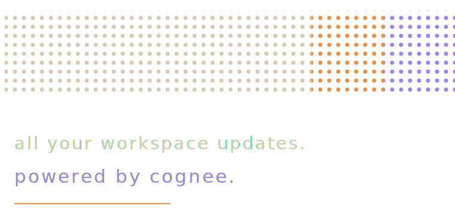

<p align="center">
  
</p>

<h1 align="center">Overcode</h1>

<p align="center">
  <strong>A native desktop hub for Git workspaces, repository state, BYOK AI providers, and Cognee-backed memory.</strong>
</p>

<p align="center">
  
  
  
  
</p>

<p align="center">
  <sub>Memory powered by</sub>
  <br>
  <a href="https://www.cognee.ai">
    
  </a>
  <br>
  <a href="https://www.cognee.ai"><strong>Cognee</strong></a>
</p>

---

## What Overcode Is

Overcode is a native desktop application that consolidates local Git state, GitHub, and GitLab into a single operator workspace. It is built for engineers who maintain multiple repositories, monitor pull requests and merge requests, and switch between branches, worktrees, and stashes during a normal working day.

The data plane is local. Repositories are read directly from disk through `simple-git` in an isolated worker process. Remote provider data is pulled per-account through user-scoped OAuth and cached locally. AI calls are explicit, routed through the selected provider, and recorded in a local audit log. Cognee is used as an optional repository memory layer for approved summaries and structured facts.

There is no Overcode backend.

---

## Capabilities

| Capability | What it does |
| --- | --- |
| Local workspace scan | Recursively discovers Git repositories beneath operator-configured roots. |
| Repository dashboard | Shows branches, uncommitted files, stashes, worktrees, recent commits, and file-system refresh state. |
| Activity feed | Unifies commits, pull-request transitions, issue updates, and pipeline outcomes across linked accounts. |
| Pull-request console | Combines GitHub PRs and GitLab MRs with hunk-level navigation. |
| Issue console | Shows cross-provider issues with assignee and linked-PR context. |
| AI panel | Runs impact analysis, commit assistance, repository briefings, stash annotation, worktree comparison, code explanation, issue triage, and daily standup generation. |
| Cognee memory | Remembers approved repository summaries, risk notes, module facts, decisions, and recall context across sessions. |

Each AI feature routes through `electron/lib/ai-runtime.ts` and validates structured responses before rendering them. On parse failure the response is repaired once; if repair fails, the UI falls back to a local-data-only envelope instead of surfacing a raw exception.

---

## Architecture Overview

Three isolated process tiers:

1. **Main process** ([electron/](electron/)) - IPC handlers, OAuth callback servers, AI provider adapters, Cognee adapter, and `electron-store` persistence at `~/.overcode/config.json`.
2. **Preload bridge** ([electron/preload.ts](electron/preload.ts)) - typed `window.api` exposed through `contextBridge`.
3. **Renderer** ([src/](src/)) - React 18 + TypeScript, Zustand state, and vanilla CSS design tokens.

`simple-git` and `chokidar` run inside an Electron `utilityProcess` worker so the main process and renderer remain responsive against large repositories.

Architecture diagrams are documented in [ARCHITECTURE_DIAGRAMS.md](ARCHITECTURE_DIAGRAMS.md) and the accompanying Excalidraw source files.

---

## Why Native Desktop

Overcode reads local files and watches them continuously. A hosted web app would need per-folder browser permission, has weaker file-watch behavior, and would require a backend for OAuth callbacks and token storage.

| Concern | Native desktop behavior |
| --- | --- |
| Local repository access | Direct OS-gated filesystem access. |
| File-system change events | Continuous `chokidar` watcher in a utility process. |
| OAuth callback | Local callback server on `127.0.0.1`, started on demand. |
| Credential storage | `electron-store` on the operator's endpoint, encrypted through Electron `safeStorage` when available. |
| Offline behavior | Local Git views remain usable without network. |
| Deployment | One desktop artifact per platform. |

---

## System Requirements

| Component | Minimum |
| --- | --- |
| Operating system | macOS 11, Windows 10 22H2, or glibc 2.31+ Linux |
| Memory | 4 GB available |
| Disk | 500 MB for the application, plus repository metadata cache |
| Network | Outbound HTTPS to OpenRouter, OpenAI, Anthropic, Gemini / AI Studio, Cognee if configured, GitHub, GitLab, and any configured enterprise instances |
| Accounts | Optional AI provider API keys, optional Cognee endpoint, optional GitHub and GitLab OAuth applications |

---

## Running From Source

```bash
git clone https://github.com/Timidan/overcode.git
cd overcode
npm install
cp .env.example .env
npm run dev
```

For a clean development run:

```bash
./scripts/clean-start.sh
```

To remove all stored state, delete `~/.overcode/` or run:

```bash
./scripts/clean-start.sh --reset-user-data
```

---

## AI Provider Setup

Overcode uses bring-your-own-key AI providers. You can save keys for OpenRouter, OpenAI, Anthropic, and Gemini, then choose one active provider and model under Settings -> AI Providers.

OpenRouter is the default because it exposes a broad model catalog, including free and paid models. Direct provider keys are supported for users who prefer billing through OpenAI, Anthropic, or Google AI Studio.

Paid models are allowed. Overcode marks provider-billed models before activation and does not charge for model usage.

Stored Settings values take precedence over environment variables.

### In-App Setup

1. Open **Settings -> AI providers**.
2. Choose OpenRouter, OpenAI, Anthropic, or Gemini.
3. Paste the provider API key, then click **Save credentials**.
4. Choose a catalog model or enter a manual model ID.
5. Acknowledge provider billing if the selected model is paid or pricing is unknown, then click **Activate provider**.

Credentials are persisted to `~/.overcode/config.json` and encrypted with Electron `safeStorage` whenever the operating-system keystore is available. On systems without a keystore, values are stored as plaintext in that file.

### Environment Variables

| Provider | Environment variables |
| --- | --- |
| OpenRouter | `OPENROUTER_API_KEY`, accepted alias `OPENROUTER`, optional `OPENROUTER_MODEL`, optional `OPENROUTER_BASE_URL` |
| OpenAI | `OPENAI_API_KEY` |
| Anthropic | `ANTHROPIC_API_KEY` |
| Gemini / AI Studio | `GEMINI_API_KEY`, accepted alias `GOOGLE_API_KEY` |

Run the generic smoke path with:

```bash
node scripts/smoke-ai-provider.mjs
```

Run the OpenRouter-specific check directly with:

```bash
node scripts/smoke-openrouter.mjs
```

---

## Cognee Memory Setup

Cognee memory is enabled when an endpoint and API key are present. `COGNEE_API_URL` is the canonical endpoint variable, while `COGNEE_SERVICE_URL` and `COGNEE_BASE_URL` are accepted aliases.

| Key | Required | Notes |
| --- | --- | --- |
| `COGNEE_API_URL` | one endpoint key | Preferred Cognee API base URL, without a trailing route. |
| `COGNEE_SERVICE_URL` | one endpoint key | Accepted alias. |
| `COGNEE_BASE_URL` | one endpoint key | Accepted alias. |
| `COGNEE_API_KEY` | yes | Sent by the main process; never exposed to the renderer. |

Cognee runs in context-only mode. It stores approved repository memory and recall context, not raw source, raw diffs, prompt bodies, credentials, OAuth tokens, or `.env` values.

---

## GitHub And GitLab OAuth

If you want the unified PR, issue, and pipeline console, register OAuth applications and enter the client credentials under **Settings -> Integrations**.

| Provider | OAuth callback URL | Where to register |
| --- | --- | --- |
| GitHub | `http://127.0.0.1:3000/callback` | GitHub developer settings |
| GitLab | `http://127.0.0.1:3001/callback` | GitLab profile applications |

Both providers are optional. Local Git views work without either.

---

## Build

```bash
npm run build
```

Useful platform-specific commands:

```bash
npx electron-builder --linux AppImage
npx electron-builder --win nsis
npx electron-builder --mac dmg
```

Output is written to `release/0.1.0/`.

---

## Security And Privacy

| Boundary | Implementation |
| --- | --- |
| Secrets in version control | `.env` is ignored. Keys, tokens, and OAuth client secrets are not committed. |
| Credential storage | OAuth and AI provider credentials are written by the main process. The renderer cannot read the raw credential store or secret blobs through IPC. |
| OAuth flow | A random `state` parameter is validated on callback. Local callback servers bind to `127.0.0.1` and are started only for a single authorization round-trip. |
| Renderer trust boundary | Token material, raw OAuth responses, and raw AI request bodies do not cross the preload bridge. |
| External URL handling | `shell:open` validates URLs against an allowlist before calling `shell.openExternal`. |
| Repository data | Repository content stays on the operator's endpoint except for explicit AI calls and approved Cognee memory writes. Audit metadata is stored locally without prompt or response bodies. |

---

## Release Notes

### 0.1.0

- Desktop Git workspace hub with GitHub and GitLab OAuth.
- BYOK-provider-backed AI panel and inline PR analysis workflows.
- Cognee-backed repository memory surfaces for remember, recall, improve, and forget flows.
- Linux AppImage, Windows NSIS, and macOS DMG build targets.

---

## License

Provided as-is for evaluation; a formal license will be assigned subsequently.
